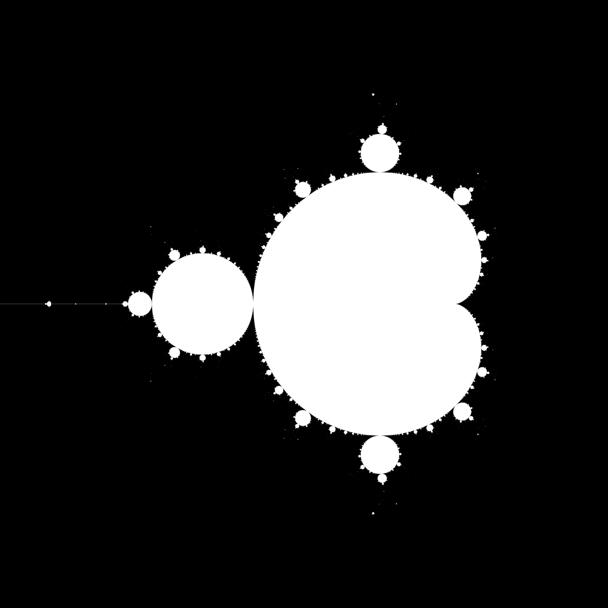

# Mandelbrot OpenMP

Implementation of the Mandelbrot set equation parallelized using OpenMP.

## Dependencies

Before running the code, install the PNG development library. On Debian/Ubuntu:

```bash
sudo apt-get install libpng-dev
```

## How to Run

Use the provided script to compile and run:

```bash
./run.sh
```

or


```bash
./run_all_mandelbrot.sh
```

To recreate all the images in this repository.

Alternatively, compile manually:

```bash
cd src
make all
```

Then run:

```bash
./mandel
```

## Results

Below are some example renderings with different ranges:




You can specify custom ranges to generate different images.
